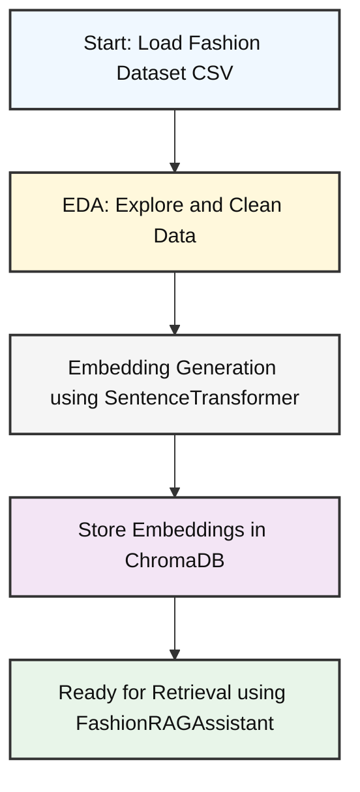
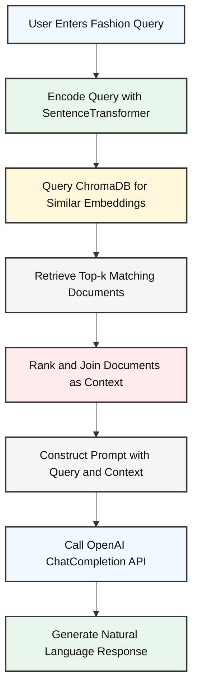

# 👗 Fashion RAG Assistant

This project builds a **Retrieval-Augmented Generation (RAG)** pipeline to enable intelligent fashion product search and question answering using a **fashion dataset**, **ChromaDB**, **Sentence Transformers**, and **OpenAI GPT**. It includes both a backend logic layer and an interactive Streamlit-based UI.

---

## 🗂️ Project Structure

```
FASHION DATASET V2.CSV/
│
├── chromadb_data/               # Vector store (ChromaDB persistent storage)
├── Fashion Dataset v2.csv       # Original fashion product dataset
│
├── fashion_rag.py               # Main class (FashionRAGAssistant) for RAG logic
├── myntra_rag_system.ipynb      # EDA, embeddings, and ChromaDB population
├── streamlit.py                 # Streamlit UI for visual query interface
│
├── README.md
├── requirements.txt
└── .env                         # OpenAI API key and other secrets
```

---

## 🔍 Components Overview

### 1. `myntra_rag_system.ipynb`
- Performs **Exploratory Data Analysis (EDA)** on the fashion dataset.
- Generates **embeddings** using `SentenceTransformer`.
- Indexes fashion products into **ChromaDB** for persistent vector search.

### 2. `fashion_rag.py`
- Defines the `FashionRAGAssistant` class.
- Loads the vector DB from disk using ChromaDB.
- Performs **semantic search** based on user query.
- Uses **OpenAI GPT (chat.completions)** to answer fashion queries with retrieved context.

### 3. `streamlit.py`
- Provides a **visual interface** to input fashion-related queries.
- Displays the top-k similar products and the generated answer using `FashionRAGAssistant`.

---

## 🚀 How to Run

### 1. Clone the Repository

```bash
git clone https://github.com/yourusername/fashion-rag-assistant.git
cd fashion-rag-assistant
```

### 2. Set Up Environment

```bash
python -m venv venv
source venv/bin/activate  # or .\venv\Scripts\activate on Windows
pip install -r requirements.txt
```

### 3. Set Your OpenAI Key

Create a `.env` file in the root directory:

```
OPENAI_API_KEY=your_openai_key_here
```

### 4. First run the myntra_rag_system.ipynb file to set up the embeddings and search layer
### 5. And to get the visual search experience run below command to have chat like experience.

```bash
streamlit run streamlit.py
```
```bash
streamlit run streamlit.py
```

---

## 📊 Example Use Case

Ask questions like:
- _"Show me casual summer wear under ₹1000"_
- _"Find red floral dresses similar to Zara's latest collection"_

And get relevant product recommendations with AI-powered answers.

---

## 🧩 Architecture


### 🛠 Architecture Overview: EDA to Embedding Storage



### 🔍 FashionRAGAssistant Architecture: Retrieval-Augmented Generation Flow



## 📦 Requirements

Installed via `requirements.txt`:

- `openai`
- `chromadb`
- `sentence-transformers`
- `streamlit`
- `python-dotenv`

---

## 🧠 Credits

Created by Divyesh Sharma. Powered by OpenAI, ChromaDB, HuggingFace Transformers, and Streamlit.

---

## 📃 License

MIT License
